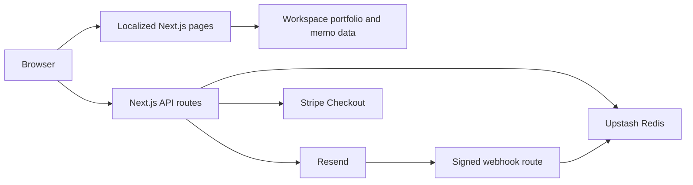

# Technical Architecture

This guide owns cross-service boundaries, domain ownership, deployment gating, and review evidence. Service-specific procedures remain in the [Redis](UPSTASH_REDIS_INTEGRATION.md), [Resend](RESEND_INTEGRATION.md), and [Stripe](STRIPE_INTEGRATION.md) guides.

## Application boundaries

Pages render localized server components; interactive controls use small client boundaries. Pure support amounts and types live in `src/features/support/support-config.ts`. Stripe, Redis, Resend and preference-token modules declare `server-only`. Node tests and the operator CLI load `scripts/register-server.mjs` to resolve TypeScript imports and transpile TSX for email rendering. This loader bypasses the `server-only` marker for Node entry points and does not type-check; TypeScript checks and Next.js build-time boundary enforcement remain separate.

`src/app/_components` composes page chrome and feature content, including the Home page's portfolio and memo sections. `src/features` groups `portfolio`, `memos`, `subscriptions`, `contact`, and `support`. Feature data, CSS Modules, domain types, and controls stay with their owner; provider operations and coordination live in feature `server` directories. Shared utilities and clients remain in `src/lib`, and shared UI in `src/components`.

Transactional email templates stay in their owning features and share `src/components/email-layout.tsx`. The root `emails/` directory only composes fictional local previews; see [email templates](RESEND_INTEGRATION.md#email-templates-and-local-preview). The preview composition imports templates without importing service modules. Production rendering runs in server delivery paths, and preference retries retain their stored HTML and plain text.

Dependencies flow from application composition to features to shared modules. Features do not import other features or the application; ESLint enforces these boundaries. Use direct module imports, not barrels that mix server and client code. The application supplies the footer's subscription slot and injects the welcome memo provider into subscription orchestration. The provider is called only after confirming that the contact is not already subscribed.

Each page has one focusable main landmark, with navigation and the footer outside it. Three language-specific catch-all routes reuse localized 404 views. Support verification and saved email preferences stream through local Suspense boundaries; the header and hero do not wait for provider responses. Locale-specific error boundaries expose retry and home actions, while the global error uses a minimal document fallback. Error views do not display raw errors or provider data.

Language links accept a server-validated query allowlist. Preference links retain only a valid token. Support links retain recognized status, a validated Session ID, or a complete recovery attempt with its amount and original checkout locale. Query parameters never confirm payment. Article metadata and safely serialized Article JSON-LD derive from the localized memo catalog, without inventing modification dates.

Portfolio and memo pages read versioned workspace data at build or request time; Redis is not their source of truth. Contact and subscription routes call Resend. Redis supplies rate limiting, subscriber locks, retry payloads and a durable journal around uncertain subscriber writes. Rate limiting has a local fallback, while subscription and preference mutations fail closed if coordination is unavailable. The Support route creates a hosted Stripe Session; the return page verifies payment status server-side. The Resend webhook accepts signed delivery feedback and shares the subscriber lock. See the service guides for failure recovery and operator actions.

## Domain and service ownership

As reported by the project owner on 2026-09-22, `modernfundamentalanalyst.com` has transferred from Wix to Vercel. Manage the domain through Vercel; verify the authoritative nameservers before making DNS changes. The canonical website remains `https://www.modernfundamentalanalyst.com`, defined by `SITE_URL` in [src/lib/site-config.ts](../src/lib/site-config.ts). A registrar transfer does not require changing application URLs.

Preserve the root and `www` website records and the Resend verification, sending and receiving records for `mail.modernfundamentalanalyst.com`. Use the current provider dashboards for exact DNS values; do not copy historical records or assume that registrar transfer also changed authoritative DNS. See [Resend receiving](RESEND_INTEGRATION.md#receiving) and [Stripe Checkout behavior](STRIPE_INTEGRATION.md#checkout-behavior) for their separate service settings. Provider status recorded here is owner-reported, not a live DNS or delivery verification.

## Production gate

Vercel's configured build command waits up to 30 minutes for the latest push CI run on `main` matching `VERCEL_GIT_COMMIT_SHA`. The macOS job allows 20 minutes of execution; the extra wait covers ordinary queueing while leaving build headroom under Vercel's [45-minute build limit](https://vercel.com/docs/limits#build-time-per-deployment). Longer queues can still time out and require a fresh deployment of the verified commit. Only `success` proceeds. Preview and local builds skip this gate. Normal polling runs once per minute. Transient network and server failures back off up to four minutes; rate-limit responses honor `Retry-After` and quota-reset headers within the same total deadline. Missing metadata, non-retryable API errors, cancellation and timeout fail closed. No additional GitHub credential is required for the public repository. The repository must remain publicly readable, or the gate must gain scoped authentication before making it private. The gate adds wait time to Vercel builds and requires `vercel.json` build commands to remain in effect. Do not put it in `npm run build`: CI itself must build without waiting on its own completion.

## Review evidence

`audit/` holds local screenshots and dated review notes. Git and Vercel exclude it; existing files are retained on disk. These historical observations are not the current issue list and are not shared with a fresh clone. Keep durable decisions and operating instructions in the relevant tracked guide. If evidence needs to be shared, prepare a separate reviewed artifact with relative image links and record its date, commit, environment and resolution status; local absolute paths are not portable.

The Ubuntu Chromium and macOS WebKit CI jobs run independently; the workflow and exact-commit production gate succeed only when both pass. Browser variants are separate cases so retries target the failure. WebKit uses fresh browser processes across two sequential shards because a long-lived worker previously stalled late in the suite. CI retains traces from failed attempts and all retries, including retries that pass, plus screenshots of failed attempts. Artifacts are uploaded even when the job ultimately passes and retained for seven days. WebKit shards run in separate steps and write to distinct `test-results/webkit-shard-1/` and `test-results/webkit-shard-2/` directories so the second run cannot erase the first run's evidence. Local failures retain traces in `test-results/`. See [`playwright.config.ts`](../playwright.config.ts), [`ci.yml`](../.github/workflows/ci.yml), and [README verification](../README.md#verification) for current commands, project settings and artifact paths.

The split follows the [Next.js testing guide](https://nextjs.org/docs/app/guides/testing): Node's isolated test runner covers service logic, while Playwright checks rendered pages and interactions against a production build. Browser project, shard and retry-trace settings follow the [Playwright projects](https://playwright.dev/docs/test-projects), [sharding](https://playwright.dev/docs/test-sharding) and [trace viewer](https://playwright.dev/docs/trace-viewer) guides.
