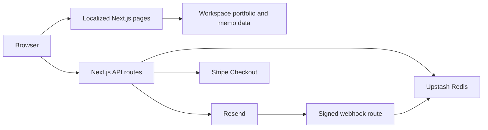

# Technical Architecture

This guide owns cross-service boundaries, domain ownership, deployment gating, and review evidence. Service-specific procedures remain in the [Redis](UPSTASH_REDIS_INTEGRATION.md), [Resend](RESEND_INTEGRATION.md), and [Stripe](STRIPE_INTEGRATION.md) guides.

## Application boundaries

Pages render localized server components; interactive controls use small client boundaries. Pure support amounts and types live in `src/features/support/support-config.ts`. Stripe, Redis, Resend and preference-token modules declare `server-only`. Node tests and the operator CLI load `scripts/register-server.mjs` to resolve TypeScript imports and transpile TSX for email rendering. This loader bypasses the `server-only` marker for Node entry points and does not type-check; TypeScript checks and Next.js build-time boundary enforcement remain separate.

`src/app/_components` composes page chrome and feature content, including the Home page's portfolio and memo sections. `src/features` groups `portfolio`, `memos`, `subscriptions`, `contact`, and `support`. Feature data, CSS Modules, domain types, and controls stay with their owner; provider operations and coordination live in feature `server` directories. Shared utilities and clients remain in `src/lib`, and shared UI in `src/components`.

Transactional email templates stay in their owning features and share `src/components/email-layout.tsx`. Each feature’s `previews/` directory composes fictional local previews; see [email templates](RESEND_INTEGRATION.md#email-templates-and-local-preview). The preview composition imports templates without importing service modules. Production rendering runs in server delivery paths, and preference retries retain their stored HTML and plain text.

Dependencies flow from application composition to features to shared modules. Features do not import other features or the application; ESLint enforces these boundaries. Use direct module imports, not barrels that mix server and client code. The application supplies the footer's subscription slot and injects the welcome memo provider into subscription orchestration. The provider is called only after confirming that the contact is not already subscribed.

Browser forms call typed request functions in their owning feature's `contact-api.ts` or `subscription-api.ts`. These functions own endpoints and input contracts and use the shared `postJson` transport for bounded requests, HTTP errors and idempotency headers. They return successful completion without asserting an unvalidated JSON response type. Routes still validate untrusted input at runtime. The preference mutation route validates HTTP input and tokens, then maps the feature service's result to an HTTP response; subscriber locks, journals, language synchronization, rollback and unsubscribe belong to `server/update-subscription-preferences.ts`.

Each page has one focusable main landmark, with navigation and the footer outside it. Three language-specific catch-all routes reuse localized 404 views. Payment verification and saved email preferences stream through local Suspense boundaries; ordinary Support visits and retry errors resolve their native form before streaming so they work without JavaScript. The header and hero do not wait for provider responses. Locale-specific error boundaries expose retry and home actions, while the global error uses a minimal document fallback. Error views do not display raw errors or provider data.

Language links accept a server-validated query allowlist. Preference links retain only a valid token. Support links retain recognized status, a validated Session ID, or a complete recovery attempt with its amount and original checkout locale. Query parameters never confirm payment. Article metadata and safely serialized Article JSON-LD derive from the localized memo catalog, without inventing modification dates.

Portfolio and memo pages read versioned workspace data at build or request time; Redis is not their source of truth. Contact and subscription routes call Resend. Redis supplies rate limiting, subscriber locks, retry payloads and a durable journal around uncertain subscriber writes. Rate limiting has a local fallback, while subscription and preference mutations fail closed if coordination is unavailable. The Support route creates a hosted Stripe Session; the return page verifies payment status server-side. The Resend webhook accepts signed delivery feedback and shares the subscriber lock. See the service guides for failure recovery and operator actions.

## Presentation and style loading

The root layout loads `src/app/globals.css` once. PostCSS compiles Tailwind's theme and utilities; tokens remain a single source for both utility aliases and CSS Modules. The `base` layer contains the site's only normalization and document defaults. Preflight is not imported. Component-specific global selector files have been removed.

Pages assemble server-rendered `Container`, `PageHero`, button links and feature content. Customized shadcn/ui Button, Field, Input, Textarea, NativeSelect, Alert and Skeleton sources live in `src/components/ui`, with finite variants and `cn` from `src/lib/utils`. These native primitives preserve server rendering and native forms. DropdownMenu and Sheet are client primitives backed by `radix-ui`; the header composes them with genuine navigation links and the existing brand treatments. `components.json` configures future source installation without replacing the site theme or reset. Only interactive primitives and their owners declare `use client`. Adjacent private `*.styles.ts` maps contain complete static utility strings, keeping large owned layouts readable without creating shared global selectors. CSS Modules are imported by their component for chart structure and complex motion. Features keep business components and services within their boundary. Email styles do not import website utilities or modules.

Mobile navigation has explicit opening, open, closing and closed phases. The phase is the single state source: Sheet remains open until dismissal finishes, then Radix releases focus containment, background accessibility isolation and its scroll lock. Sheet handles Escape through its dismissal callback. Its focus lifecycle callbacks focus the close control on entry and restore the trigger with `preventScroll` on dismissal; route navigation suppresses trigger restoration. No parallel custom focus trap, background inert effect or fixed-body lock is retained. Its measured panel and icon animations use Web Animations API; CSS does not transition those properties simultaneously. Native disclosures remain usable without JavaScript, and enhanced closing content is inert until reopened. Provider contracts, localized routes, workspace financial data and checkout recovery remain independent of presentation.

For presentation migrations, retain screenshots and computed styles before changes, compare in the same browser and viewport, and measure production assets before making performance claims. Verify direct requests, client navigation and browser return against the production build; development hot reload is not evidence of production style ordering. Keep behavioral assertions independent of utility class strings. Physical iPhone checks remain separate from WebKit automation.

## Domain and service ownership

As reported by the project owner on 2026-09-22, `modernfundamentalanalyst.com` has transferred from Wix to Vercel. Manage the domain through Vercel; verify the authoritative nameservers before making DNS changes. The canonical website remains `https://www.modernfundamentalanalyst.com`, defined by `SITE_URL` in [src/lib/site-config.ts](../src/lib/site-config.ts). A registrar transfer does not require changing application URLs.

Preserve the root and `www` website records and the Resend verification, sending and receiving records for `mail.modernfundamentalanalyst.com`. Use the current provider dashboards for exact DNS values; do not copy historical records or assume that registrar transfer also changed authoritative DNS. See [Resend receiving](RESEND_INTEGRATION.md#receiving) and [Stripe Checkout behavior](STRIPE_INTEGRATION.md#checkout-behavior) for their separate service settings. Provider status recorded here is owner-reported, not a live DNS or delivery verification.

## Test workflow

Test selection follows [Bulletproof React's testing guidance](https://github.com/alan2207/bulletproof-react/blob/master/docs/testing.md): verify observable outcomes and prioritize integrations at service boundaries. Node tests call real route handlers and services with provider I/O mocked, while Playwright covers user interactions against the isolated application. Render real components through the shared loader instead of compiling a separate copy inside each test. Compare generated metadata, redirects, provider payloads and recovery state rather than searching for implementation names. Keep source assertions only for explicit architecture or configuration constraints that runtime tests cannot establish, such as the `server-only` declaration. Retain failures, interrupted operations and idempotent retries when consolidating cases; test count alone is not a coverage measure.

The Node loader and shared test helpers live in `scripts/`; the WebKit runner and production gate also live there. The journal CLI lives beside the subscription service in `src/features/subscriptions/server/subscription-journal-cli.mjs` and shares the Node loader through `npm run subscription:journal`. These entry points remain separate from application imports.

Module and component tests live beside their implementation in `src` as `*.test.mjs`. The Node runner discovers them recursively alongside configuration checks beside the root configuration and in `scripts/`; Playwright discovers colocated `src/**/*.spec.ts` browser workflows. Test files are not imported by application entry points. The Node loader supports application TypeScript and TSX imports without changing the existing test format.

CI checks out the explicit PR head SHA, or the exact push SHA, so test evidence identifies the actual files tested. The `plan` job uses the read-only GitHub token to decide whether a main push can reuse prior evidence. PRs always run full verification.

The `static` Ubuntu job installs locked dependencies, audits production packages, and runs types, lint, formatting and unit tests. After it passes, `chromium` builds and tests on Ubuntu while two `webkit-shards` matrix jobs each build and test on macOS. Matrix fail-fast is disabled so a failing shard does not cancel the other. Stable `verify` and `webkit` result jobs reject failed, cancelled or unexpectedly skipped dependencies. Distinct artifact names retain each shard's traces and screenshots for seven days.

`scripts/ci-plan.mjs` only reuses evidence for a two-parent merge whose Git tree matches its second parent. It requires the latest matching same-repository PR CI run to have succeeded within 24 hours, with successful `static`, `chromium`, `webkit-shard-1` and `webkit-shard-2` jobs from that run attempt. This excludes previously reused or partial runs. Changed files (including workflow, lockfile and test configuration), stale evidence, squash/rebase merges, missing records and API errors trigger full testing. Runtime and runner images can change independently of Git; reuse is intentionally limited to a recent run, not a permanent cache. The main workflow summary records the source run, tree and release SHA. Main still produces its own successful CI record for the production gate.

Local work uses affected checks. Full local `npm run verify` and `npm run test:webkit` remain available for diagnosis or explicit requests, but are not repeated routinely before release. The WebKit runner supports `--shard=1` or `--shard=2`; without a selection it runs two sequential processes locally.

## Release workflow

1. Push the reviewed PR and wait for full CI and the Vercel Preview for its head SHA.
2. When release is authorized, merge the verified PR into `main` and record the resulting SHA. GitHub automatically deletes the remote PR branch. Main CI verifies reusable evidence or runs the complete suite.
3. Confirm a Vercel production deployment exists for that SHA. Distinguish a missing Git trigger from a deployment waiting for CI, building, failed or ready. If no deployment appears, inspect the Git integration instead of rerunning successful tests. Create a deployment from that Git reference when integration recovery requires it.
4. Wait for successful release CI, Vercel `READY`, matching deployed SHA and production aliases. A ready preview or successful CI alone does not establish production success. Preserve the exact-commit gate; retry a timed-out deployment only after that same SHA has passed CI.
5. After production succeeds, fetch/prune refs, confirm no commits were added after merge, leave the merged branch and safely delete it with `git branch -d`. Remove only clean task-owned temporary worktrees when needed. Preserve ongoing work and unmerged commits; never force-delete to resolve uncertainty. Start subsequent work from current `main`.

A PR-only request does not authorize merging. Deployment includes safe local cleanup of the released branch. Production browser smoke tests are optional follow-up checks unless evidence indicates a failure. Report deployment completion promptly once version and live-state checks pass.

## Production gate

Vercel's configured build command waits up to 30 minutes for the latest push CI run on `main` matching `VERCEL_GIT_COMMIT_SHA`. The macOS job allows 20 minutes of execution; the extra wait covers ordinary queueing while leaving build headroom under Vercel's [45-minute build limit](https://vercel.com/docs/limits#build-time-per-deployment). Longer queues can still time out and require a fresh deployment of the verified commit. Only `success` proceeds. Preview and local builds skip this gate. Normal polling runs once per minute. Transient network, response-body read, JSON parsing, malformed response and server failures back off up to four minutes. The failure count resets only after a complete response has been parsed and validated; rate-limit responses honor `Retry-After` and quota-reset headers within the same total deadline. Missing metadata, non-retryable API errors, cancellation and timeout fail closed. No additional GitHub credential is required for the public repository. The repository must remain publicly readable, or the gate must gain scoped authentication before making it private. The gate adds wait time to Vercel builds and requires `vercel.json` build commands to remain in effect. Do not put it in `npm run build`: CI itself must build without waiting on its own completion.

## Review evidence

`audit/` holds local screenshots and dated review notes. Git and Vercel exclude it; existing files are retained on disk. These historical observations are not the current issue list and are not shared with a fresh clone. Keep durable decisions and operating instructions in the relevant tracked guide. If evidence needs to be shared, prepare a separate reviewed artifact with relative image links and record its date, commit, environment and resolution status; local absolute paths are not portable.

After static verification, Ubuntu Chromium and the two macOS WebKit shards run concurrently; the workflow and exact-commit production gate succeed only when both pass. Browser variants are separate cases so retries target the failure. WebKit uses fresh browser processes across two isolated shards because a long-lived worker previously stalled late in the suite. CI retains traces from failed attempts and all retries, including retries that pass, plus screenshots of failed attempts. Artifacts are uploaded even when the job ultimately passes and retained for seven days. WebKit shards run in separate matrix jobs and write to distinct `node_modules/.cache/playwright/webkit-shard-1/` and `node_modules/.cache/playwright/webkit-shard-2/` directories so the second run cannot erase the first run's evidence. Local failures retain traces in `node_modules/.cache/playwright/`. See [`playwright.config.ts`](../playwright.config.ts), [`ci.yml`](../.github/workflows/ci.yml), and [README verification](../README.md#verification) for current commands, project settings and artifact paths.

The split follows the [Next.js testing guide](https://nextjs.org/docs/app/guides/testing): Node's isolated test runner covers service logic, while Playwright checks rendered pages and interactions against a production build. Browser project, shard and retry-trace settings follow the [Playwright projects](https://playwright.dev/docs/test-projects), [sharding](https://playwright.dev/docs/test-sharding) and [trace viewer](https://playwright.dev/docs/trace-viewer) guides.
