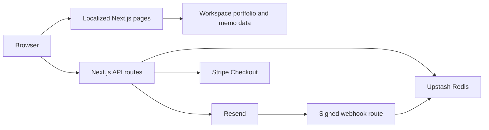

# Technical Architecture

This guide owns cross-service boundaries, domain ownership, deployment gating, and review evidence. Service-specific procedures remain in the [Redis](UPSTASH_REDIS_INTEGRATION.md), [Resend](RESEND_INTEGRATION.md), and [Stripe](STRIPE_INTEGRATION.md) guides.

## Application boundaries

Pages render localized server components; interactive controls use small client boundaries. Pure support amounts and types live in `lib/support-config.ts`. Stripe, Redis, Resend and preference-token modules declare `server-only`. Node tests and the operator CLI load `scripts/register-server.mjs`; application builds use Next.js boundary enforcement.

Portfolio and memo pages read versioned workspace data at build or request time; Redis is not their source of truth. Contact and subscription routes call Resend. Redis supplies rate limiting, subscriber locks, retry payloads and a durable journal around uncertain subscriber writes. Rate limiting has a local fallback, while subscription and preference mutations fail closed if coordination is unavailable. The Support route creates a hosted Stripe Session; the return page verifies payment status server-side. The Resend webhook accepts signed delivery feedback and shares the subscriber lock. See the service guides for failure recovery and operator actions.

## Domain and service ownership

As reported by the project owner on 2026-09-22, `modernfundamentalanalyst.com` has transferred from Wix to Vercel. Manage the domain through Vercel; verify the authoritative nameservers before making DNS changes. The canonical website remains `https://www.modernfundamentalanalyst.com`, defined by `SITE_URL` in [lib/site-config.ts](../lib/site-config.ts). A registrar transfer does not require changing application URLs.

Preserve the root and `www` website records and the Resend verification, sending and receiving records for `mail.modernfundamentalanalyst.com`. Use the current provider dashboards for exact DNS values; do not copy historical records or assume that registrar transfer also changed authoritative DNS. See [Resend receiving](RESEND_INTEGRATION.md#receiving) and [Stripe Checkout behavior](STRIPE_INTEGRATION.md#checkout-behavior) for their separate service settings. Provider status recorded here is owner-reported, not a live DNS or delivery verification.

## Production gate

Vercel's configured build command waits up to 30 minutes for the latest push CI run on `main` matching `VERCEL_GIT_COMMIT_SHA`. The macOS job allows 20 minutes of execution; the extra wait covers ordinary queueing while leaving build headroom under Vercel's [45-minute build limit](https://vercel.com/docs/limits#build-time-per-deployment). Longer queues can still time out and require a fresh deployment of the verified commit. Only `success` proceeds. Preview and local builds skip this gate. Missing metadata, GitHub API errors, cancellation and timeout fail closed. The repository must remain publicly readable, or the gate must gain scoped authentication before making it private. The gate adds wait time to Vercel builds and requires `vercel.json` build commands to remain in effect. Do not put it in `npm run build`: CI itself must build without waiting on its own completion.

## Review evidence

`audit/` holds local screenshots and dated review notes. Git and Vercel exclude it; existing files are retained on disk. These historical observations are not the current issue list and are not shared with a fresh clone. Keep durable decisions and operating instructions in the relevant tracked guide. If evidence needs to be shared, prepare a separate reviewed artifact with relative image links and record its date, commit, environment and resolution status; local absolute paths are not portable.

The Ubuntu Chromium and macOS WebKit CI jobs run independently; the workflow and exact-commit production gate succeed only when both pass. Browser variants are separate cases so retries target the failure. WebKit uses fresh browser processes across two sequential shards because a long-lived worker previously stalled late in the suite. Failed runs retain screenshots and retry traces as distinct GitHub artifacts for seven days; local failures retain traces in `test-results/`. See [`playwright.config.ts`](../playwright.config.ts), [`ci.yml`](../.github/workflows/ci.yml), and [README verification](../README.md#verification) for current commands, project settings and artifact paths.

The split follows the [Next.js testing guide](https://nextjs.org/docs/app/guides/testing): Node's isolated test runner covers service logic, while Playwright checks rendered pages and interactions against a production build. Browser project, shard and retry-trace settings follow the [Playwright projects](https://playwright.dev/docs/test-projects), [sharding](https://playwright.dev/docs/test-sharding) and [trace viewer](https://playwright.dev/docs/trace-viewer) guides.
